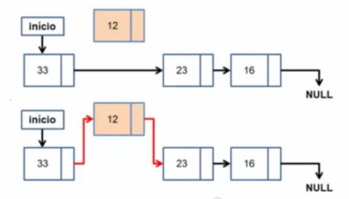

# Lista Dinamica Encadeada

## Definição

* Tipo de lista onde cada elemento aponta para o seu sucessor na lista.

* Usa um ponteiro especial para o primeiro elemento da lista e uma indicação de final de lista.

* Cada elemento é tratado como um ponteiro que é alocado dinamicamente a medida que os dados são inseridos.

* Para guardar o primeiro elemento utilizamos um ponteiro para ponteiro

* Um ponteiro para ponteiro pode guardar o endereço de um ponteiro

* Assim, fica fácil mudar quem está no início da lista mudando o conteudo do ponteiro para ponteiro

## Vantagens

* Melhor utilização dos recursos de memória

* Não precisa movimentar os elementos nas operações de inserção e remoção

## Desvantagens

* Acesso indireto aos elementos

* Necessidade de percorrer a lista para acessar um elemento

## Quando utilizar essa lista

* Quando não há necessidade de garantir um espaço mínimo para execução do aplicativo

* Inserção/Remoção em listas ordenada são as mais frequentes

