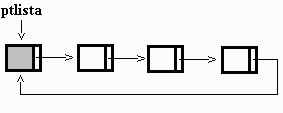

# Lista Circular

## Definição

* Tipo de lista onde cada elemento aponta para o seu sucessor e o último elemento aponta para o primeiro da lista

* Usa um ponteiro especial para o primeiro elemento da lista

* Não existe uma indicação de final de lista

* Cada elemento é tratado como um ponteiro que é alocado dinamicamente, a medida que os dados são inseridos.

* Para guardar o primeiro elemento, utilizamos um ponteiro para ponteiro

* Um ponteiro para ponteiro pode guardar o endereço de um ponteiro.

* Assim, fica fácil mudar quem está no início da lista mudando o conteúdo do ponteiro para ponteiro

## Vantagens

* Melhor utilização dos recursos de memória

* Não precisa movimentar os elementos nas operações de inserção e remoção

* Possibilidade de percorrer a lista diversas vezes

* Não precisamos considerar casos especiais de inclusão e remoção de elementos (primeiro e último)

## Desvantagens

* Acesso indireto aos elementos

* Necessidade de percorrer a lista para acessar um elemento

* Lista não possui final definido

## Quando utilizar a lista

* Não há necessidade de garantir um espaço mínimo de memória para execução

* Inserção/Remoção em lista ordenada são as operações mais frequentes

* Quando há necessidade de voltar ao primeiro item da lista após percorrê-la
