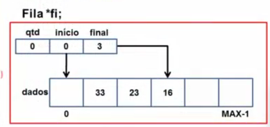

# Fila Estatica

## Definição

* Uma estrutura do tipo FILA é uma sequência de elementos do mesmo tipo, como as listas.

* Seus elementos possuem estrutura interna abstraída, ou seja, sua complexidade é arbitrária e não afeta o seu funcionamento.

* Uma fila é um tipo especial de lista:

   * A inserção e a exclusão de elementos ocorrem nas extremidades da lista

## Aplicações

* Controle de fluxo

* Recursos compartilhados (impressora, transações de banco de dados e etc)

* etc...

## Operações

* Em uma fila podemos realizar as seguintes operações

  * Criação da fila

  * Inserção de um elemento no final da fila

  * Remoção de um elemento no inicio da fila

  * Consulta ao elemento do inicio

  * Destruição da fila

* Essa operações dependem do tipo de alocação de memória usada

  * Estatica
  * Dinamica

## Alocação estatica

* O espaço de memória é alocado no momento da compilação

* Exige a definição do número máximo de elemendos da fila

* Acesso sequencial: Elementos consecutivos na memória

* Tipo de fila onde o sucessor de um elemento ocupa a posiçào física seguinte do mesmo

* Uso de arrays

## Alocação dinamica

* O espaço de memória é alocado em tempo de execução

* A fila cresce à medida que novos elementos são armazenados, e diminui a medida que elementos são removidos

* Acesso encadeado: Cada elemento pode estar em uma área distinta da memória.

  * Para acessar um elemento, é preciso percorrer todos os seus antecessores na fila.

