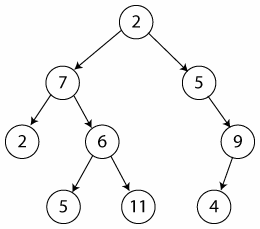

# Arvore

## Definição:

* É um tipo especial de grafo

* Qualquer par de vértices esta conectado a apenas uma aresta

* grafo conexo (existe exatamente um caminho entre qualquer dois de seus vértices) e é aciclico (não possui ciclos)

* Vertice é a bolinha e aresta a reta

  

* Como são um tipo especial de grafo, elas são definidas como um conjunto não vazio de vertices ou nós, e arestas que satisfazem requisitos

* Vertices:

  * É cada uma das entidades representadas na árvore (dependendo da natureza do problema)

* Arestas:

  * É uma conexão entre dois vertices

## Aplicações:

* Arvores são adequadas para representar estruturas hierárquicas não lineares

* Exemplo:

  * Relações de dependencia (pai, filho e etc...)

  * Diagrama hierarquico de uma organização

  * Campeonatos de modalidades desportivas

  * Taxonomia

* Em computação:

  * Estrutura de diretorios(pastas)

  * Busca de dados armazenados no computador

  * Representação de espaço de soluções (ex: jogo de xadrez)

  * modelagem de algoritmo

## Formas de representação

* Grafo (mais comum)

* Diagrama de Ven (conjuntos aninhados)

## Tipos de arvores

* Na computação existem vários tipos de arvores desenvolvidas para diferentes tipos de aplicação

  * árvore binária de busca

  * árvore AVL

  * árvore Rubro-negra

  * árvore B+

  * árvore 2-3

  * árvore 2-3-4

  * quadtree

  * octree

  * etc ...

## Propriedades

* PAI é o antecessor imediato de um vértice

* FILHO é o sucessor imediato de um vértice

* RAIZ é o vertice que não possui PAI

* NÓS TERMINAIS ou FOLHAS é qualquer vertice que não possui filho

* NÓS NÃO-TERMINAIS ou INTERNOS é qualquer vertice que contém pelo menos 1 filho

## Caminho em uma arvore

* É uma sequencia de vertices de modo que existe sempre uma aresta ligando o vértice anterior com o seguinte

* Existe exatamente um caminho entre a raiz e cada um dos nós da árvore

## Sub-arvores

* Dado um determinado vértice, cada filho seu é a raiz de uma nova sub-arvore

* De fato qualquer vertice é a raiz de uma sub-arvore consistindo dele e dos nós abaixo dele

* O GRAU DE UM VERTICE é o número de sub-arvores do vértice

## Altura da arvore

* Também chamada de profundidade

* É o comprimento do caminho mais longo da raiz até uma das suas folhas

* Seria a quantidade de niveis da raiz até o ultimo elemento da arvore

## Niveis

* Numa árvore os vertices são classificados em níveis

* O nível é o número de nós no caminho entre o vertice e a raiz

# Arvore Binaria

## Definição

* É um tipo especial de arvore

* Cada vertice possui 2 sub-arvores, sub-arvore esquerda e sub-arvore direita

* O grau de cada vertice (número de filhos) pode ser 0, 1 ou 2

## Arvore estritamente Binaria

* Cada Nó/Vertice possui 0 ou 2 sub-árvores

* Nenhum nó tem filho único

* Nós internos (não folhas) tem sempre 2 filhos

## Arvore Binaria completa

* É estritamente binaria e todos os seus nós folha estão no mesmo nível

* O número de nós de uma arvore binaria completa é 2^h-1, onde h é a altura da arvore

## Arvore Binaria quase completa

* A diferença de altura entre as sub-arvores de qualquer nó é no máximo 1.

* Se a altura da árvore é D, cada nó folha está no nível D ou D-1

# Implementação Teoria

## Operações

* Criação da arvore

* inserção de um elemento

* Remoção de um elemento

* Acesso a um elemento

* Destruição da arvore

* Essas operações depende do tipo de alocação usada

  * estática (HEAP) ou Dinamica (LISTA ENCADEADA)

## Alocação estatica

* Uso de um array

* Usa 2 funções para retornar a posição dos filhos a esquerda e a direita do pai

  * FILHO_ESQUERDA(PAI) = 2 * PAI + 1;

  * FILHO_DIREITA(PAI) = 2 * PAI + 2;

* Dado um indice de um pai no vetor o filho a esquerda dele é 2 vezes o pai mais 1 e a direita dele é 2 vezes o pai mais 2

* Muito usado quando sei o tamanho da arvore e como ela vai ficar e quando a árvore é binaria completa para que todos os niveis da arvore ou campos do vetor seja ocupado

* Não utilizar quando tiver arvores que não seja binaria completa, pois ficará espaços do vetor sem usar

## Alocação Dinamica

* uso de lista encadeada

* Cada nó da arvore é tratado como um ponteiro alocado dinamicamente a medida que os dados são inseridos

* Para guardar o primeiro nó da arvore utilizamos um ponteiro para ponteiro

* Um ponteiro para ponteiro pode guardar o endereço de um ponteiro

* Assim, fica fácil mudar quem é a raiz da árvore (se necessário)

### Criar e destruir uma arvore

* Criação da arvore: ato de criar a raiz da arvore.

  * A raiz da arvore é um tipo de nó especial que aponta para o primeiro elemento da arvore

* Destruição da arvore: Envolve percorrer todos os nós da arvore de modo a liberar a memória alocada para cada um deles

  

### Percorrer arvore:

* Altura da arvore e contando os nós seguem quase a mesma lógica:
  

* Percorrendo arvore binaria:

  * Muitas operações em árvores binarias necessitam que se percorra todos os nós de suas sub-arvores, executando alguma ação ou tratamento em cada nó

  * Cada nó é visitado uma única vez

  * Isso gera uma seguência linear de nós, cuja ordem depende de como a arvore for percorrida.

  * Podemos percorrer a arvore de 3 formas:

    * **Pré-Ordem:** visita a raiz, o filho da esquerda e o filho da direita
      

    * **Em-Ordem:** visita o filho da esquerda, a raiz e o filho da direita
      

    * **Pos-Ordem:** visita o filho da esquerda, o filho da direita e depois a raiz, destruir arvore, contar nós e altura
      

# Arvore Binaria de Busca

## Definição:

* É um tipo de arvore binaria onde cada nó possui um valor (chave) associado a ele, e esse valor determina a posição do nó na arvore

* Não existe valores repetidos

## Posicionamento dos valores

* Para cada nó pai:

  * todos os valores da sub-arvore esquerda são menores do que o nó pai

  * todos os valores da sub-arvore direita são maiores do que o nó pai

* A inserção e remoção de nós da arvore deve ser realizadas respeitando as propriedades da arvore

## Aplicações

* Busca binaria

* Análise de expressões algébricas: prefixa, infixa e pósfixa

* etc...

## Principais operações

* Inserção:

  * Caso medio: O(log n)
  * Pior caso: O(n) (Arvore não balanceada)

* Remoção:

  * Caso medio: O(log n)
  * Pior caso: O(n) (Arvore não balanceada)

* Consulta:

  * Caso médio: O(log n)
  * Pior caso: O(n) (Arvore não balanceada)

* Arvore não balanceada é quando tem muita gente do lado esquerdo da arvore e pouca do lado direito, ou vise-versa

## Inserção na arvore binaria de busca

* Para inserir um valor "V" qualquer na árvore binária de busca primeiro vamos fazer uma consulta na arvore binaria:

  * Primeiro compare com a raiz:

  * "V" é menor do que a raiz?

    * Vá para a sub-arvore esquerda

  * "V" é maior do que a raiz?

    * Vá para a sub-arvore direita

  * Aplique o método recursivamente (pode ser feito sem recursão)

* Também existe o caso onde a inserção é feita em uma arvore binaria que está vazia

  * *raiz = novo_no;

## Remoção na arvore binaria de busca

* Existe 3 tipos de remoção:

  * nó folha (sem filhos)
  * nó com 1 filho
  * nó com 2 filhos (insere o ultimo elemento a direita do nó a ser removido no lugar dele)

* Os 3 tipos de remoção trabalham juntos

* Cuidado:

  * Não se pode remover de uma arvore vazia

  * Removendo o ultimo nó a arvore fica vazia

